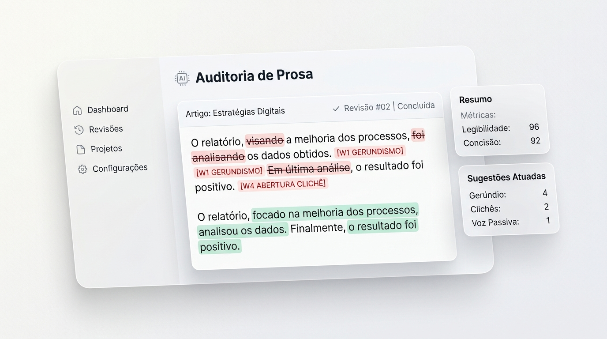

<div align="center">

# 🇧🇷 Deslop PT-BR
### O Guia Definitivo e Linter contra Vícios de Escrita de IA em Português do Brasil

**Transforme textos gerados por IA em prosa autêntica que um leitor humano leria com prazer — sem pasteurizar a voz do autor, sem clichês corporativos e com tolerância zero a alucinações.**

[](LICENSE)
[](#)
[](SKILL.md)
[](#)
[](#)

<br />



<p align="center">
  <a href="#-o-problema">O Problema</a> •
  <a href="#-o-loop-editorial-deslop-pt-br">O Loop Editorial</a> •
  <a href="#-instalação-rápida">Instalação</a> •
  <a href="#-os-38-sinais-de-alerta-w1-a-w38">Sinais de Alerta</a> •
  <a href="#-os-13-perfis-de-voz">Perfis de Voz</a> •
  <a href="#-comprovações-e-casos-reais">Antes & Depois</a> •
  <a href="#-detector-cli--build-gate-em-python">Linter & CI/CD</a> •
  <a href="#-créditos-e-inspirações">Créditos</a>
</p>

</div>

---

## 🛑 O Problema

A escrita de inteligência artificial tem um odor característico. No Brasil, esses vícios tornam-se ainda mais bizarros porque os modelos de linguagem (ChatGPT, Claude, Gemini, Llama) misturam:

1. **Gerundismo de telemarketing/SAC:** `Vou estar enviando o arquivo para validação`.
2. **Falsa análise de impacto no final de frases:** `..., demonstrando nosso compromisso inegociável e consolidando nossa liderança`.
3. **Oficialês de fórum jurídico do século XIX em Slack e LinkedIn:** `Ademais, destarte cumpre salientar que...`.
4. **Traduções literais constrangedoras do inglês:** `Mergulhar em uma rica tapeçaria de desafios` (*delve into a rich tapestry*), `alavancar` (*leverage*), `orquestrar` (*orchestrate*).
5. **Aberturas vazias de quem está 'limpando a garganta':** `No cenário atual, em um mundo cada vez mais conectado...`.
6. **O maniqueísmo dramático:** `Não é sobre velocidade. É sobre confiabilidade.`.

O leitor brasileiro reconhece esse padrão instantaneamente. O resultado é perda de credibilidade, rejeição do público e textos que parecem ter saído da mesma impressora burocrática.

O **Deslop PT-BR** resolve isso através de um padrão aberto de regras editoriais, um linter com pontuação determinística que pode barrar o seu build e um loop fechado de purificação entre modelos de IA rivais.

---

## 🔄 O Loop Editorial Deslop PT-BR

O linter tem a primeira e a última palavra, porque o linter é objetivo e o modelo de IA é persuasivo:

```text
1. AUDITAR    scripts/detector_ptbr.py  Avalia o texto de 0 a 100, bloqueia no CI se houver vício
2. REESCREVER Três fases editoriais     1: Corta vocabulário ➔ 2: Quebra formas ➔ 3: Devolve a humanidade
3. PURIFICAR  scripts/cleanse_ptbr.py   Um modelo rival remove os cacoetes que o autor original não ouviu
4. RE-AUDITAR scripts/detector_ptbr.py  Libera a publicação apenas se estiver 100% limpo
```

<!-- 
======================================================================
📍 SUGESTÃO DE IMAGEM 1: O LOOP EDITORIAL (The Anti-Slop Loop)
Posicione aqui a imagem ilustrando o fluxo circular de 4 etapas:
Auditar (Scanner) ➔ Reescrever (Editor) ➔ Purificar (Modelo Rival) ➔ Re-auditar (Green Gate).
Arquivo sugerido: assets/loop-deslop-ptbr.png
======================================================================
-->
> [!TIP]
> **Fluxo de 4 Etapas:** Nunca publique um texto sem passar pela re-auditoria final. Um modelo de fronteira é excelente para remover vícios antigos e perfeitamente capaz de introduzir novos enquanto reescreve.

---

## ⚡ Instalação Rápida

O **Deslop PT-BR** foi desenvolvido no padrão aberto [Agent Skills](https://agentskills.io) e possui integrações nativas para todos os principais ambientes:

### 1. Claude Code
Copie a pasta ou o arquivo de skill para o seu diretório de skills:
```bash
# Na raiz do seu projeto
mkdir -p .claude/skills/deslop-ptbr
cp -r /caminho/para/deslop-ptbr/* .claude/skills/deslop-ptbr/
```

### 2. Cursor IDE
Copie a regra pré-configurada para o seu projeto:
```bash
mkdir -p .cursor/rules
cp integrations/cursor/deslop-ptbr.mdc .cursor/rules/
```

### 3. Windsurf
Copie a regra para as configurações do Windsurf:
```bash
mkdir -p .windsurf/rules
cp integrations/windsurf/deslop-ptbr.md .windsurf/rules/
```

### 4. Agente Hermes (NousResearch)
```bash
mkdir -p ~/.hermes/skills/writing/deslop-ptbr
cp integrations/hermes/deslop-ptbr.md ~/.hermes/skills/writing/deslop-ptbr/SKILL.md
```

### 5. OpenAI Codex
O Codex lê nativamente o padrão [Agent Skills](https://developers.openai.com/codex/skills). Basta clonar ou copiar para o diretório `.agents/skills/`:
```bash
mkdir -p ~/.agents/skills/deslop-ptbr
cp -r /caminho/para/deslop-ptbr/* ~/.agents/skills/deslop-ptbr/
```

### 6. ChatGPT, Claude.ai ou Gemini Web
Não usa terminal? Basta abrir o arquivo [`dist/standalone-prompt.md`](dist/standalone-prompt.md), copiar o texto e colar nas suas **Instruções Personalizadas (Custom Instructions)** ou nas configurações do seu **Custom GPT** / **Claude Project**.

---

## 🛡️ As 3 Leis Editoriais Invioláveis

Toda edição realizada por este projeto obedece a salvaguardas rigorosas (detalhadas em [`references/01-contrato-editorial.md`](references/01-contrato-editorial.md)):

1. **Trava Factual Absoluta:** Proibido inventar dados, números, datas, causas ou anedotas/vivências pessoais fictícias (*"outro dia eu estava tomando um café quando..."*). Se faltar um dado, mantemos a generalidade ou marcamos `[DADO REAL NECESSÁRIO]`.
2. **Preservação da Voz Autoral (Edição Mínima Eficaz):** O objetivo é limpar os vícios de máquina, não transformar o texto em uma cartilha pasteurizada. Preservamos o humor, a franqueza, a informalidade e a cadência do autor original.
3. **Guarda de Falso Positivo em PT-BR:** Contrações da oralidade brasileira (*"tá"*, *"pra"*, *"né"*, *"a gente"*), fragmentos dramáticos intencionais e regionalismos legítimos **não são vícios de IA** e devem ser mantidos.

---

## 🤖 Purificação com Modelo Rival (Rival Model Cleanse)

**A regra:** a etapa de purificação roda em uma **família de modelos diferente** daquela que redigiu o rascunho. Diferentes famílias têm sotaques diferentes, e uma IA é péssima para identificar os próprios vícios de escrita.

| Onde você trabalha | Sotaque do Rascunho | O `cleanse_ptbr.py` faz |
|---|---|---|
| **Claude Code** | Anthropic | Chama o **GPT-5 / GPT-4o** via CLI `codex`, em sandbox somente leitura |
| **Codex / ChatGPT** | OpenAI | Configure `DESLOP_ESCRITOR=gpt` e ele chama o **Claude** via `claude -p` |
| **Gemini CLI** | Google | Utiliza a CLI rival que estiver disponível no sistema |
| **Sem CLI instalado** | — | Exibe o prompt completo formatado para você colar no chat da outra família |

O script separa a resposta automaticamente:
* **STDOUT:** apenas o texto purificado (permite redirecionamento limpo: `python scripts/cleanse_ptbr.py draft.md > limpo.md`).
* **STDERR:** as notas de edição apontando exatamente quais vícios foram removidos e por quê.

```bash
# Limpar um rascunho com modelo rival
python scripts/cleanse_ptbr.py rascunho.md > limpo.md

# Re-auditar imediatamente o texto purificado
python scripts/detector_ptbr.py limpo.md --fail-if-slop
```

---

## 📋 Os 38 Sinais de Alerta (W1 a W38)

Nosso catálogo classifica os vícios em três níveis de severidade (consulte [`references/02-padroes-ptbr.md`](references/02-padroes-ptbr.md)):

| Código | Sinal de Alerta | Severidade | Exemplo de Gatilho / Vício |
|---|---|:---:|---|
| **W1** | Gerundismo Corporativo / SAC | 🔴 Alta | `Vou estar enviando o relatório` ➔ `Vou enviar` |
| **W2** | Gerúndio Conclusivo Redundante | 🔴 Alta | `..., destacando a importância de...` ➔ Corte |
| **W3** | Conectivos Arcaicos de Oficialês | 🔴 Alta | `ademais`, `outrossim`, `destarte`, `no bojo de` |
| **W4** | Abertura Genérica (Throat-Clearing) | 🔴 Alta | `No cenário atual...`, `Em um mundo conectado...` |
| **W5** | Contraste Binário Vazio | 🔴 Alta | `Não é sobre X, é sobre Y` ➔ Afirme Y direto |
| **W6** | Tríades Ornamentais Simétricas | 🔴 Alta | `eficiência, agilidade e excelência` (Tricolon) |
| **W7** | Revelações Teatrais com Dois-Pontos | 🔴 Alta | `O detalhe crucial: ele aprende sozinho.` |
| **W8** | Adjetivos Inflados de Vendas | 🔴 Alta | `revolucionário`, `game-changer`, `seamless` |
| **W9** | Falsos Amigos de Tradução de IA | 🔴 Alta | `mergulhar em`, `tapeçaria`, `orquestrar`, `alavancar` |
| **W10** | Falsa Celebração Corporativa | 🔴 Alta | `Temos o imenso prazer de anunciar...` |
| **W11** | Falsa Inclusão ("Seja X ou Y") | 🔴 Alta | `Seja você um dev júnior ou um CTO sênior...` |
| **W12** | Pivôs de Falsa Conversação | 🔴 Alta | `A verdade é que:`, `Para ser sincero:` |
| **W13** | Fechamento Falso-Profundo | 🔴 Alta | `O futuro já está aqui`, `Afinal, a única constante...` |
| **W14** | Resumo Inútil em Textos Curtos | 🟡 Média | `Em suma`, `Em conclusão` em textos de 300 palavras |
| **W15** | Travessões em Excesso (Em-dash) | 🟡 Média | Dois ou mais travessões longos (—) na mesma oração |
| **W16** | Voz Passiva Sistemática | 🟡 Média | `Foi verificado que` ➔ `A equipe verificou que` |
| **W17** | Perguntas Retóricas como Transição | 🟡 Média | `Mas como alcançar isso? Usando nosso app.` |
| **W18** | Hedging / Incerteza Vazia | 🟡 Média | `Pode ser potencialmente possível que...` |
| **W19** | Substantivação em Cadeia | 🟡 Média | `a realização da execução da melhoria` ➔ `melhorar` |
| **W20** | Atribuição Vaga (Falsa Autoridade) | 🟡 Média | `Estudos comprovam que`, `Especialistas dizem` |
| **W21** | Emojis Decorativos como Muleta | 🟡 Média | `🚀` `💡` `🎯` polvilhados no meio de frases ou títulos |
| **W22** | Blocos de Hashtags no Rodapé | 🟡 Média | `#Inovação #Tech #FuturoDoTrabalho #Liderança` |
| **W23** | Aspas de Distanciamento (Scare Quotes)| 🟡 Média | Usar aspas para tentar parecer irônico ou esperto |
| **W24** | Metadiscurso Interpretativo | 🟡 Média | `Preste atenção nisso:`, `O ponto-chave é:` |
| **W25** | Jargões Corporativos Ocos | 🟡 Média | `mindset`, `visão holística`, `gerar sinergia` |
| **W26** | Repetição de Sinônimos em Ciclo | 🟡 Média | Trocar 'servidor' por 4 palavras diferentes por vaidade |
| **W27** | Ritmo Metronômico | 🟢 Baixa | Todas as frases com exatamente 18 palavras |
| **W28** | Intensificadores Vazios ("Muito") | 🟢 Baixa | `muito rápido` ➔ `responde em 12ms` |
| **W29** | Repetição Cíclica da Tese | 🟢 Baixa | Redefinir a premissa a cada nova seção |
| **W30** | Negrito Pulverizado sem Critério | 🟢 Baixa | Negritar palavras aleatórias sem função de navegação |
| **W31** | Listas de Bullets Desnecessárias | 🟢 Baixa | Transformar raciocínios simples em listas artificiais |
| **W32** | Aspas Tipográficas Inglesas | 🟢 Baixa | Aspas curvas (`“ ”`) que quebram código e terminais |
| **W33** | Conectivos Mecânicos em Série | 🟢 Baixa | `Primeiramente`, `Em segundo lugar`, `Por outro lado` |
| **W34** | Clichês Vintage da Internet | 🟢 Baixa | `uma vez visto não dá pra desver`, `bateu diferente` |
| **W35** | Metáforas de Física/Biologia | 🟢 Baixa | `DNA da empresa`, `salto quântico na estratégia` |
| **W36** | Dramatização de Erros | 🟢 Baixa | `Ops! Infelizmente algo deu errado` em interfaces |
| **W37** | Objeções Imaginárias (Shadowboxing) | 🔴 Alta | `Você pode estar pensando que... Não estamos dizendo que` |
| **W38** | Resíduo de Chatbot (Chatbot Residue)| 🔴 Alta | `Com certeza!`, `Certamente!`, `Espero ter ajudado!` |
| **PROOF**| Prova Social Fabricada | 🔴 Alta | `Mais de 10.000 clientes satisfeitos` sem auditoria |

---

## 🎭 Os 13 Perfis de Voz Brasileiros

O deslop adapta o registro conforme o objetivo do seu texto (veja detalhes em [`references/04-perfis-de-voz.md`](references/04-perfis-de-voz.md)):

1. **🖋️ Crônica / Ensaio Pessoal:** Coloquialidade culta, ironia leve e observação reflexiva do cotidiano.
2. **📰 Jornalístico (Folha / Piauí):** Sujeito + Verbo + Objeto, dados verificáveis, zero adjetivação vazia.
3. **🎓 Acadêmico sem Burocratês:** Precisão conceitual e metodológica sem latinismos fósseis.
4. **💬 Corporativo Informal (Slack / Startup BR):** Ágil, direto, terminologia de tecnologia natural.
5. **📱 Post de Rede Social (LinkedIn / X Brasil):** Gancho na primeira linha, parágrafos curtos, zero pieguice.
6. **📲 WhatsApp / Mensagem Rápida:** Oralidade pura, contrações autênticas (*"tá"*, *"pra"*), zero enrolação.
7. **⚖️ Jurídico Esclarecido:** Mantém a terminologia técnica do Direito sem prolixidade inútil.
8. **📚 Didático / Explicador:** Analogias concretas, ritmo de conversa e clareza para documentações.
9. **📋 Português Simplificado (Lei 15.263/2025):** Frases curtas (13-18 palavras), máxima acessibilidade ao cidadão.
10. **➡️ Assertivo / Executivo:** Conclusão ou recomendação na linha 1; negrito funcional para decisões.
11. **🔹 Enxuto / Terminal / Dev:** Fatos e comandos diretos; zero conversa fiada.
12. **📊 Resumo / Status Board:** TL;DR no topo e checklist visual (✅/🟡/🔴).
13. **🌐 Voz Neutra Informativa:** Clareza e precisão padrão.

---

## 🔎 Comprovações e Casos Reais

<!-- 
======================================================================
📍 SUGESTÃO DE IMAGEM 2: ANTES & DEPOIS (Visual Split Comparison)
Posicione aqui a imagem de comparação dividida:
Lado Esquerdo (Vermelho Mudo): Texto Plastificado de IA com vícios destacados.
Lado Direito (Verde Esmeralda): Texto Humano Direto e Deslopado.
Arquivo sugerido: assets/comparativo-antes-depois.png
======================================================================
-->

### Exemplo 1: Comunicado de Engenharia
* **❌ IA Slop:**
  > ~~No cenário atual, em que a escalabilidade é fundamental, temos o prazer de anunciar que estaremos realizando a migração do banco de dados para PostgreSQL. Não é apenas uma mudança técnica, mas um divisor de águas que demonstra nosso compromisso inegociável com a inovação e consolida nossa liderança. Ademais, o novo banco permitirá mergulhar em uma rica tapeçaria de consultas com extrema robustez. O futuro já começou! 🚀~~
* **✅ Humano (Deslop PT-BR):**
  > **Migramos o banco de dados principal para PostgreSQL nesta madrugada. A mudança reduziu o tempo médio de consulta de 450ms para 35ms e eliminou os travamentos que ocorriam durante os picos de tráfego das 18h. Os serviços já estão operando normalmente.**

### Exemplo 2: Landing Page / SaaS
* **❌ IA Slop:**
  > ~~Nossa plataforma revolucionária não é apenas um software, é uma jornada transformadora feita sob medida para empoderar seu time com agilidade, eficiência e inovação sem atritos. Amado por mais de 50.000 clientes satisfeitos em todo o Brasil.~~
* **✅ Humano (Deslop PT-BR):**
  > **Você conecta a sua conta bancária e o painel categoriza suas notas fiscais automaticamente em menos de três minutos. Sem planilhas manuais e sem redigitação.**

---

## 💻 Detector CLI & Build Gate em Python

O repositório inclui um linter de linha de comando leve (**zero dependências externas**, biblioteca padrão do Python) projetado para rodar localmente ou atuar como **Build Gate em CI/CD**:

<!-- 
======================================================================
📍 SUGESTÃO DE IMAGEM 3: O GUARDIÃO DO CI/CD (Terminal Build Gate)
Posicione aqui a imagem mostrando a interface do terminal CLI:
Varredura bloqueando build vermelho e aprovando merge em verde com 100% limpo.
Arquivo sugerido: assets/terminal-build-gate.png
======================================================================
-->

```bash
# Auditar texto diretamente na linha de comando:
python scripts/detector_ptbr.py --text "No cenário atual, vou estar enviando os dados."

# Auditar arquivo Markdown (ignora código, preserva prosa):
python scripts/detector_ptbr.py docs/artigo.md --markdown

# Auditar página HTML renderizada (extrai apenas o texto visível):
python scripts/detector_ptbr.py index.html

# Auditar apenas uma aba ou seção específica do HTML por ID:
python scripts/detector_ptbr.py index.html --view hero

# Seus números de clientes são reais e comprovados? Libere a regra PROOF:
python scripts/detector_ptbr.py index.html --allow-proof

# Falhar com código de erro se houver qualquer vício de IA (Modo Build Gate):
python scripts/detector_ptbr.py index.html --fail-if-slop

# Saída estruturada em JSON (para integrações e dashboards):
python scripts/detector_ptbr.py docs/artigo.md --json
```

### GitHub Actions Build Gate
Adicione o workflow já configurado em `.github/workflows/deslop-gate.yml` ao seu projeto para impedir que textos com cheiro de IA cheguem a produção:

```yaml
- name: Auditar Documentação contra Vícios de IA
  run: python scripts/detector_ptbr.py README.md --markdown --allow-proof --fail-if-slop
```

### Executar a Bateria de Testes Automatizados:
```bash
python -m unittest discover tests/ -v
```

---

## 📚 Estrutura do Repositório

```text
deslop-ptbr/
├── README.md                      # Documentação completa e guia canônico
├── SKILL.md                       # Agent Skill universal (Claude Code, Codex, Hermes)
├── LICENSE                        # Licença MIT
├── .github/
│   └── workflows/
│       └── deslop-gate.yml        # CI/CD Build Gate para GitHub Actions
├── prompts/
│   └── cleanse_ptbr.txt           # Prompt mestre de purificação em 3 etapas com sentinela
├── references/                    # Guias completos e canônicos
│   ├── 01-contrato-editorial.md   # Trava factual, ética e salvaguardas
│   ├── 02-padroes-ptbr.md         # Catálogo completo dos 38 sinais (W1 a W38)
│   ├── 03-tabela-substituicoes.md # Tabela em Tiers (1A, 1B, 2 e 3)
│   ├── 04-perfis-de-voz.md        # 13 perfis calibrados para o Brasil
│   └── 05-exemplos-antes-depois.md# Estudos de caso práticos
├── dist/
│   └── standalone-prompt.md       # Prompt único para ChatGPT/Claude Web
├── integrations/                  # Regras prontas para IDEs e agentes
│   ├── cursor/                    # Regra para Cursor (.cursor/rules/)
│   ├── windsurf/                  # Regra para Windsurf (.windsurf/rules/)
│   ├── copilot/                   # Instruções para GitHub Copilot
│   └── hermes/                    # Skill nativa para o agente Hermes
├── scripts/
│   ├── detector_ptbr.py           # Linter CLI determinístico e build gate
│   ├── cleanse_ptbr.py            # Purificador multiplataforma com modelo rival
│   └── cleanse_ptbr.sh            # Wrapper bash para Unix/CI
└── tests/
    ├── test_detector.py           # Testes de não-regressão do linter
    └── test_cleanse.py            # Testes unitários do purificador
```

---

## 🤝 Créditos e Inspirações

Este projeto é uma obra comunitária que une as melhores práticas internacionais com a profunda sensibilidade linguística brasileira:

1. [**SlopMonster**](https://github.com/ItsssssJack/SlopMonster) (Jack & comunidade) — Pela filosofia de build gate implacável, pelo conceito de purificação com modelo rival (*"um modelo não ouve o próprio sotaque"*) e pela técnica de isolamento e stand-in de Markdown/HTML.
2. [**stop-slop**](https://github.com/hardikpandya/stop-slop) (Hardik Pandya) — Pela arquitetura modular e elegância das regras fundamentais.
3. [**no-ai-slop**](https://github.com/petergyang/no-ai-slop) (Peter Yang) — Pelo teste da portabilidade e preservação incansável da voz autoral.
4. [**deslop-text**](https://github.com/adamdunkels/deslop-text) (Adam Dunkels) — Pela taxonomia sistemática e rigorosa dos *warning signs*.
5. [**avoid-ai-writing**](https://github.com/conorbronsdon/avoid-ai-writing) (Conor Bronsdon) — Pelo contrato editorial estrito e pelo sistema de vocabulário em Tiers.
6. [**humanizar**](https://skilldev.pro/skills/humanizar/) (Fabricio Telles / Skill+DEV) — Pela sensibilidade aos padrões nativos do português brasileiro e formulação da Trava Factual Canônica.
7. [**humanizer**](https://github.com/blader/humanizer) (Pedro Sorrentino / Blader) — Pela técnica de *Match Your Voice*, erradicação de resíduos de chatbot e combate a objeções imaginárias.

---

## 📄 Licença

Distribuído sob a licença **MIT**. Sinta-se livre para usar em projetos comerciais, pessoais, plugins ou integrá-lo ao seu fluxo de agentes.
